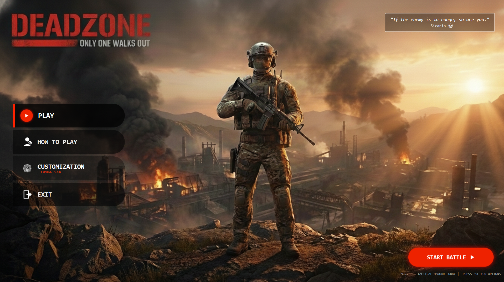
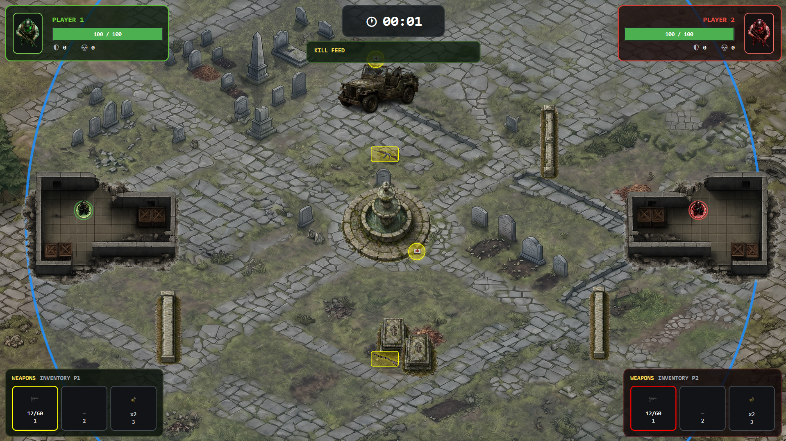
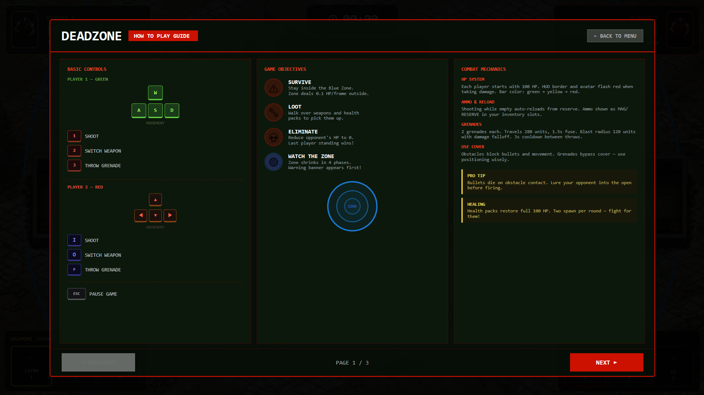
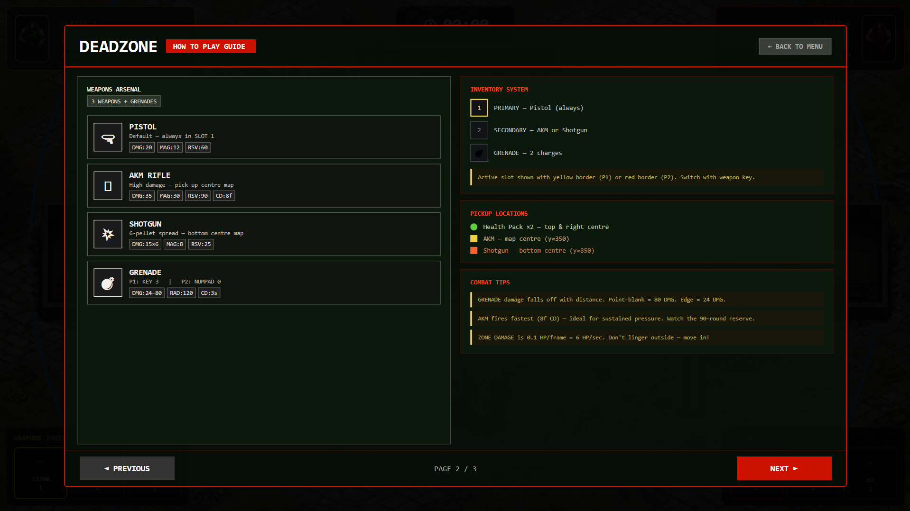
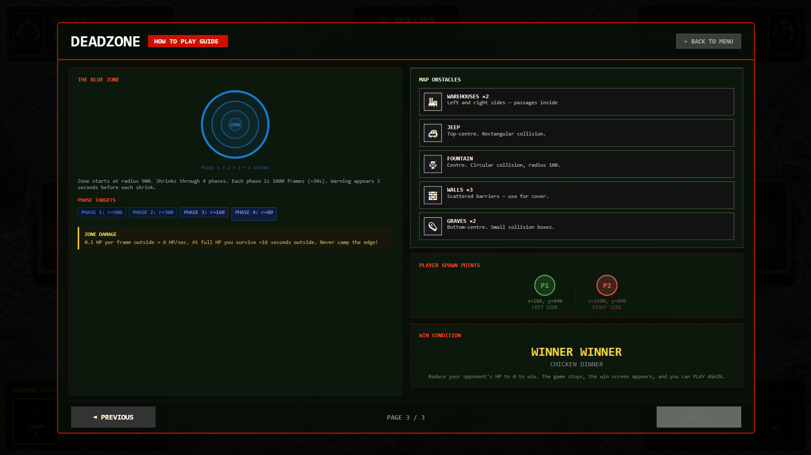

<div align="center">
🎯 DEADZONE
Only One Walks Out


A 1v1 tactical battle-royale built in C# / WPF — two players, one shrinking zone, last one standing wins.
</div>
---
📸 Preview
<div align="center">

<br><br>

</div>
---
🕹️ About
DEADZONE is a multiplayer tactical survival game where two players compete on the same screen, managing health, weapons, grenades, and a shrinking safe zone. No twitch-shooter mechanics — it's built around positioning, resource management, and decision-making under pressure. Built as a Visual Programming course project (CS-211) to demonstrate GUI design, event-driven programming, OOP, animation, and multimedia integration in WPF.
✨ Features
Feature	Details
Two-player split-control battle	WASD + 1/2/3 (P1) vs Arrow keys + I/O/P (P2)
3-weapon arsenal	Pistol, AKM Rifle, Shotgun — each with unique damage/mag/reload
Grenade system	Area damage, falloff by distance, 3s cooldown
Shrinking blue zone	4 phases, radius 900 → 80, deals 6 HP/sec outside
Health pickups	Two spawn per round, full heal
Live HUD	Health bars, ammo counter, kill feed, round timer
Inventory system	Switchable weapon slots with visual active-slot indicator
Audio	Background music + sound effects
Win/Lose screen	"Winner Winner Chicken Dinner"
In-game How-To-Play guide	3-page interactive tutorial
🎮 Controls
Action	Player 1 (Green)	Player 2 (Red)
Move	`W` `A` `S` `D`	Arrow keys
Shoot	`1`	`I`
Switch Weapon	`2`	`O`
Throw Grenade	`3`	`P`
Pause	`ESC`	`ESC`
🔫 Weapons
Weapon	Damage	Magazine	Reserve	Notes
Pistol	20	12	60	Default, always in slot 1
AKM Rifle	35	30	90	Fastest fire rate (8f cooldown), spawns map center
Shotgun	15×6 pellets	8	25	Spread shot, spawns bottom-center
Grenade	24–80 (falloff)	2 charges	—	280-unit travel, 120-unit blast radius, 3s cooldown
🔵 The Blue Zone
Starts at radius 900, shrinks across 4 phases (1800 frames / ~30s each), 3-second warning before each shrink.
Phase	Radius
1	500
2	300
3	160
4	80
Outside the zone deals 0.1 HP/frame (~6 HP/sec) — full-health survival time outside is ~16 seconds.
🎨 Color Theme
Element	Color
Background	Dark Green
HUD	Dark Black
Blue Zone	Blue
Health Indicators	Green
Danger Alerts	Red
Weapon Highlights	Yellow
Text	White
🛠️ Tech Stack
Built with C# / WPF in Visual Studio.
`Window` · `Grid` · `Canvas` · `Border` · `StackPanel` · `Button` · `TextBlock` · `ProgressBar` · `Image` · `Ellipse` · `Rectangle` · `ItemsControl` · `ViewBox` · `DispatcherTimer`
🧩 Core Classes
Class	Description
`MainWindow`	Main game controller
`Bullet`	Bullet properties and movement
`Obstacle`	Collision handling
`HealthPickup`	Health item management
`WeaponPickup`	Weapon collection management
`GrenadeProjectile`	Grenade behavior
`WeaponType`	Weapon enumeration
📖 How To Play
<div align="center">

<br><br>

<br><br>

</div>
🚀 Getting Started
Clone the repo
```bash
   git clone https://github.com/Mr-Zulki/deadzone-game.git
   ```
Open `DEADZONE.sln` in Visual Studio
Restore NuGet packages if prompted
Build & run (`F5`)
🗺️ Roadmap
[ ] Character customization
[ ] AI-controlled enemy mode
[ ] Online multiplayer
[ ] Leaderboards
👥 Team
Visual Programming (CS-211), Section C — University of Faisalabad
Name	Role
Muhammad Zulqurnain Hyder	Player System & Weapon System, GUI Design & Documentation
Furqan Raza	Blue Zone System, Testing
Subhan Gill	Inventory System, Sound Effects
Abdul Rehman	HUD & Menu System, Debugging
---
<div align="center">
<sub>Built with WPF. Survive the zone.</sub>
</div>
